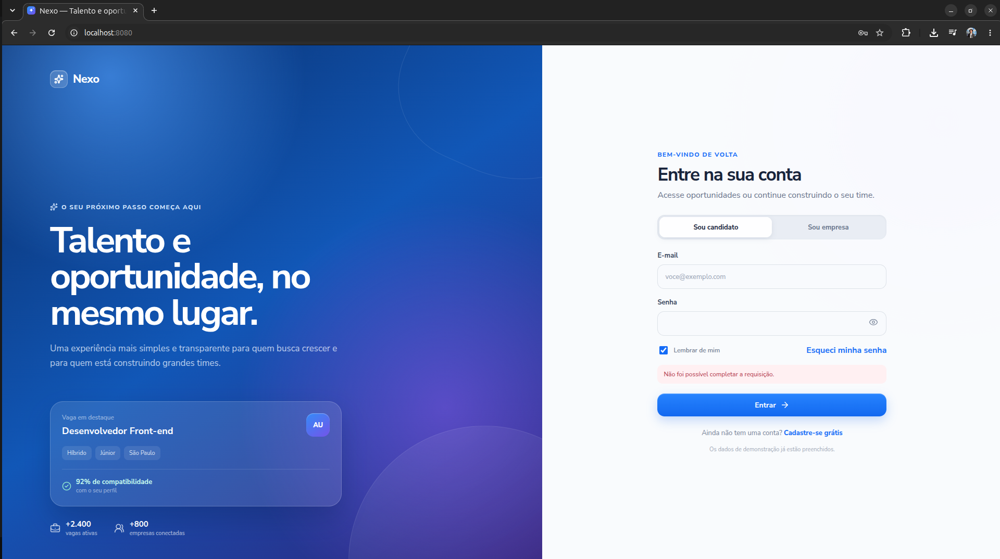
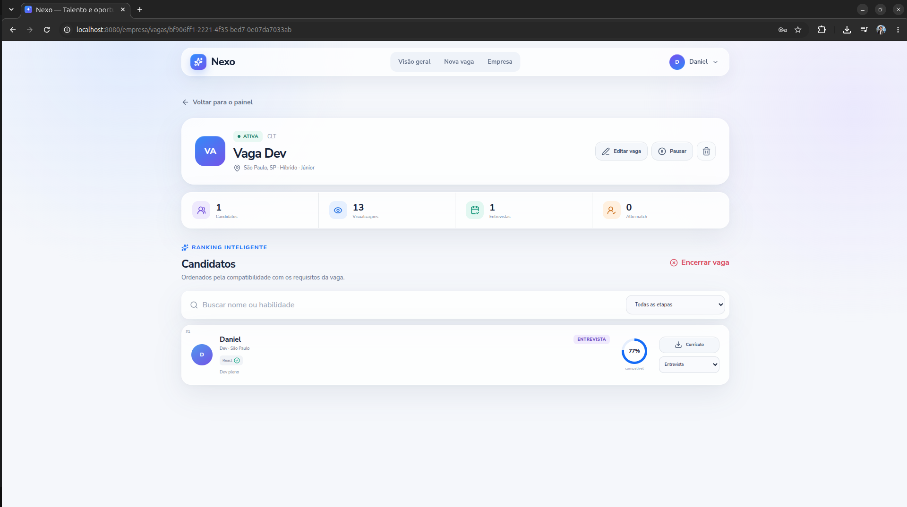
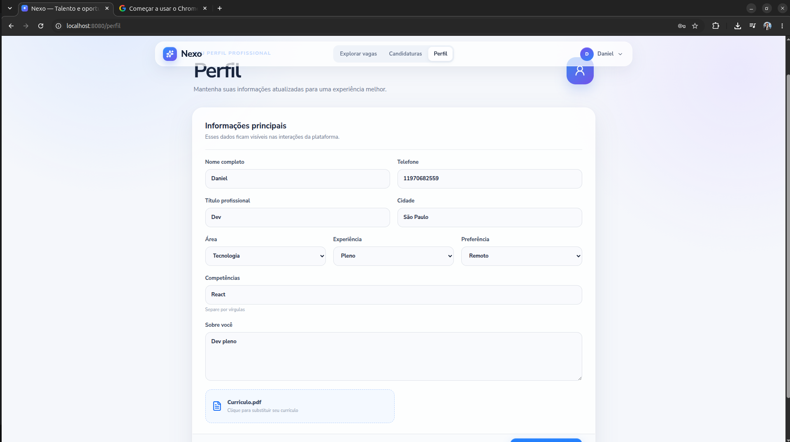

# Projeto Integrador Nexo

## Integrantes do grupo

- ANDRE IKEJIRI HILARIO
- ANNA CLARA MEIRELLES IANZER
- DANIEL BERG DOS SANTOS NASCIMENTO
- GIOVANNI MADALOZZO OLIVEIRA
- HUGO RIBEIRO RAMADAN
- MARIA HELENA GRACA LOPES
- PALOMA FREDIANI VIEITZ GIL

## Documentação

Os objetivos do projeto estão detalhados no documento [PROJETO2026.docx.pdf](./docs/PROJETO2026.docx.pdf).

## Vídeo do projeto funcionando

[PI_NEXO.mp4](./PI_NEXO.mp4) - 1:09 min

https://youtu.be/fGdOkCf0PlI (vídeo extendido - 6 min)

## Executando com Docker Compose

Este projeto usa Docker Compose para subir os seguintes serviços:

- **db**: banco de dados PostgreSQL 16, exposto na porta `5432`, com os scripts de inicialização em `Backend/dbfiles` e dados persistidos no volume `db_data`.
- **frontend**: aplicação frontend, construída a partir de `frontend/Dockerfile` e exposta na porta `8080`.
- **auth-service**: microsserviço de autenticação, construído a partir de `Backend/auth-service/Dockerfile`.
- **jobs-service**: microsserviço de vagas, construído a partir de `Backend/jobs-service/Dockerfile`.
- **applications-service**: microsserviço de candidaturas, construído a partir de `Backend/applications-service/Dockerfile`.
- **krakend**: API Gateway que centraliza o acesso aos microsserviços de backend, exposto na porta `8000`. Configuração em `Backend/krakend/krakend.json` (veja `Backend/krakend/README.md`).

### Pré-requisitos

- [Docker](https://docs.docker.com/get-docker/)
- [Docker Compose](https://docs.docker.com/compose/install/) (já incluído no Docker Desktop)

### Subir os containers

Na raiz do projeto, execute:

```bash
docker compose up -d
```

O comando irá:

1. Construir a imagem do frontend (`frontend/Dockerfile`).
2. Construir as imagens dos três serviços de backend: `auth-service`, `jobs-service` e `applications-service`.
3. Baixar as imagens do PostgreSQL 16 e do KrakenD.
4. Subir todos os serviços em segundo plano.

### Acessando os serviços

- Frontend: [http://localhost:8080](http://localhost:8080)
- API Gateway (KrakenD): [http://localhost:8000](http://localhost:8000)
- Banco de dados: `localhost:5432`
  - Usuário: `nexo`
  - Senha: `nexo`
  - Database: `nexo`

### Ver logs

```bash
docker compose logs -f
```

Ou de um serviço específico:

```bash
docker compose logs -f frontend
docker compose logs -f db
```

### Reconstruir imagens após alterações

```bash
docker compose up -d --build
```

### Parar os containers

```bash
docker compose down
```

Para remover também o volume de dados do banco:

```bash
docker compose down -v
```
## Telas do projeto

### Login



### Cadastro de candidato


### Cadastro de empresa


### Explorar vagas


### Detalhe da vaga


### Candidaturas



### Perfil do candidato



### Painel da empresa


### Nova vaga (empresa)


### Detalhe da vaga (empresa)


### Perfil da empresa


## Backend

O backend é dividido em três microsserviços independentes (`auth-service`, `jobs-service` e `applications-service`), cada um com seu próprio código-fonte em `Backend/`, e todos compartilham o mesmo banco PostgreSQL. O acesso a eles é feito exclusivamente através do API Gateway (KrakenD), que é o único ponto de entrada exposto ao frontend.

### Modelo de entidades

O banco (script de inicialização em [`Backend/dbfiles/01_init.sql`](Backend/dbfiles/01_init.sql)) é organizado em torno da entidade central `users`, que representa tanto candidatos quanto empresas (diferenciados pela coluna `role`):

- **users**: tabela base de contas (candidato ou empresa), com dados de autenticação (`email`, `password_hash`).
- **candidate_profiles**: dados de perfil específicos de um candidato, em relação 1-para-1 com `users` (a chave primária é também chave estrangeira para `users.id`).
  - **candidate_skills**: lista de habilidades do candidato, em relação N-para-1 com `candidate_profiles` (um candidato pode ter várias skills).
- **company_profiles**: dados de perfil específicos de uma empresa, também em relação 1-para-1 com `users`.
- **jobs**: vagas publicadas, cada uma pertencente a uma empresa (`company_id` referencia `users.id`) — relação N-para-1 (uma empresa pode ter várias vagas).
  - **job_responsibilities**, **job_requirements**, **job_skills**, **job_benefits**: listas associadas a uma vaga (responsabilidades, requisitos, habilidades exigidas e benefícios), todas em relação N-para-1 com `jobs`.
- **applications**: candidaturas de um candidato a uma vaga, ligando `jobs` e `users` — cada candidatura referencia uma vaga (`job_id`) e um candidato (`candidate_id`), com a restrição de que um mesmo candidato não pode se candidatar duas vezes à mesma vaga (`UNIQUE (job_id, candidate_id)`).

Ou seja, o fluxo de relacionamento é: um `user` do tipo empresa cria `jobs`, e um `user` do tipo candidato cria `applications` para essas vagas, sendo que os detalhes de cada perfil e de cada vaga ficam em tabelas satélites ligadas por chave estrangeira.

<!-- TODO: adicionar aqui a imagem do diagrama entidade-relacionamento (ER) -->

### Como funciona o KrakenD

O [KrakenD](https://www.krakend.io/) atua como **API Gateway**: é o único endereço (`http://localhost:8000`) que o frontend precisa conhecer, e ele se encarrega de rotear cada requisição para o microsserviço correto, sem que o frontend precise saber a porta ou o host interno de cada serviço.

Principais pontos da configuração (em [`Backend/krakend/krakend.json`](Backend/krakend/krakend.json), detalhada em [`Backend/krakend/README.md`](Backend/krakend/README.md)):

### Endpoints disponíveis e testes com curl

Todos os endpoints abaixo são acessados através do gateway, na base `http://localhost:8000`. Endpoints marcados com 🔒 exigem o header `Authorization: Bearer <token>` (obtido no login).

| Método | Endpoint | Serviço |
|--------|----------|---------|
| POST | `/api/auth/register` | auth-service |
| POST | `/api/auth/login` | auth-service |
| GET 🔒 | `/api/auth/me` | auth-service |
| PUT 🔒 | `/api/auth/me` | auth-service |
| GET 🔒 | `/api/auth/profile/candidate` | auth-service |
| PUT 🔒 | `/api/auth/profile/candidate` | auth-service |
| GET 🔒 | `/api/auth/profile/company` | auth-service |
| PUT 🔒 | `/api/auth/profile/company` | auth-service |
| GET 🔒 | `/api/auth/candidates/{candidateId}` | auth-service |
| GET | `/api/jobs` | jobs-service |
| POST 🔒 | `/api/jobs` | jobs-service |
| GET | `/api/jobs/{jobId}` | jobs-service |
| PUT 🔒 | `/api/jobs/{jobId}` | jobs-service |
| DELETE 🔒 | `/api/jobs/{jobId}` | jobs-service |
| GET 🔒 | `/api/applications` | applications-service |
| POST 🔒 | `/api/applications` | applications-service |
| GET 🔒 | `/api/applications/{applicationId}` | applications-service |
| PUT 🔒 | `/api/applications/{applicationId}` | applications-service |

Exemplos de `curl` (ajuste os valores de exemplo conforme necessário):

```bash
# Cadastro
curl -X POST http://localhost:8000/api/auth/register \
  -H "Content-Type: application/json" \
  -d '{"name":"Maria Candidata","email":"maria@teste.com","password":"senha123","role":"candidate"}'

# Login (guarde o token retornado)
curl -X POST http://localhost:8000/api/auth/login \
  -H "Content-Type: application/json" \
  -d '{"email":"maria@teste.com","password":"senha123"}'

# Dados do usuário autenticado
curl http://localhost:8000/api/auth/me \
  -H "Authorization: Bearer SEU_TOKEN_AQUI"

# Atualizar perfil do candidato
curl -X PUT http://localhost:8000/api/auth/profile/candidate \
  -H "Authorization: Bearer SEU_TOKEN_AQUI" \
  -H "Content-Type: application/json" \
  -d '{"city":"São Paulo","area":"Backend","experience":"Pleno"}'

# Listar vagas
curl http://localhost:8000/api/jobs

# Detalhe de uma vaga
curl http://localhost:8000/api/jobs/ID_DA_VAGA

# Criar vaga (autenticado como empresa)
curl -X POST http://localhost:8000/api/jobs \
  -H "Authorization: Bearer SEU_TOKEN_AQUI" \
  -H "Content-Type: application/json" \
  -d '{"title":"Desenvolvedor Backend","location":"São Paulo","workplace":"Remoto"}'

# Candidatar-se a uma vaga
curl -X POST http://localhost:8000/api/applications \
  -H "Authorization: Bearer SEU_TOKEN_AQUI" \
  -H "Content-Type: application/json" \
  -d '{"jobId":"ID_DA_VAGA"}'

# Listar candidaturas de uma vaga
curl "http://localhost:8000/api/applications?jobId=ID_DA_VAGA" \
  -H "Authorization: Bearer SEU_TOKEN_AQUI"
```

### Subindo somente o backend

Para trabalhar apenas na API, sem precisar construir/subir o `frontend`, é possível iniciar só os serviços de backend (banco, microsserviços e gateway) informando os nomes dos serviços ao `docker compose up`:

```bash
docker compose up -d db auth-service jobs-service applications-service krakend
```

Isso sobe o PostgreSQL, os três microsserviços e o KrakenD, deixando a API completa disponível em `http://localhost:8000` sem construir a imagem do frontend. Para acompanhar os logs apenas do backend:

```bash
docker compose logs -f auth-service jobs-service applications-service krakend
```
